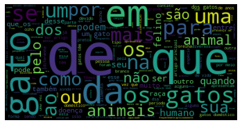
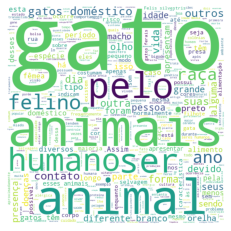
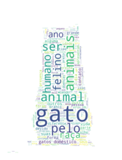
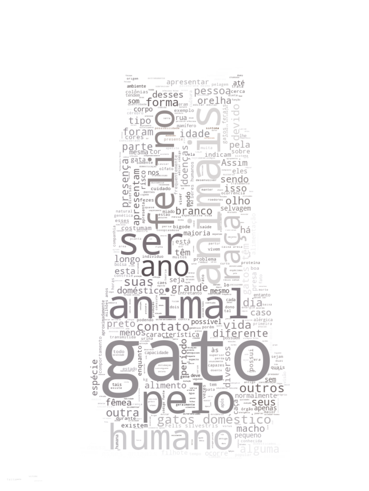

## Google Colab Word Cloud

* Create a simple cat word cloud, to study data science in Google Colab Notebook.
> Exercise source in:

* Article:
> https://carolinescholles.com/br/nuvem-de-palavras-em-python/

* Notebook:
> https://colab.research.google.com/drive/1hf9azPsCbrwSusFaMB3Y6gc4JBSc9xIN?usp=sharing#scrollTo=ohXPvQ3kUph9

* Customized Mask

